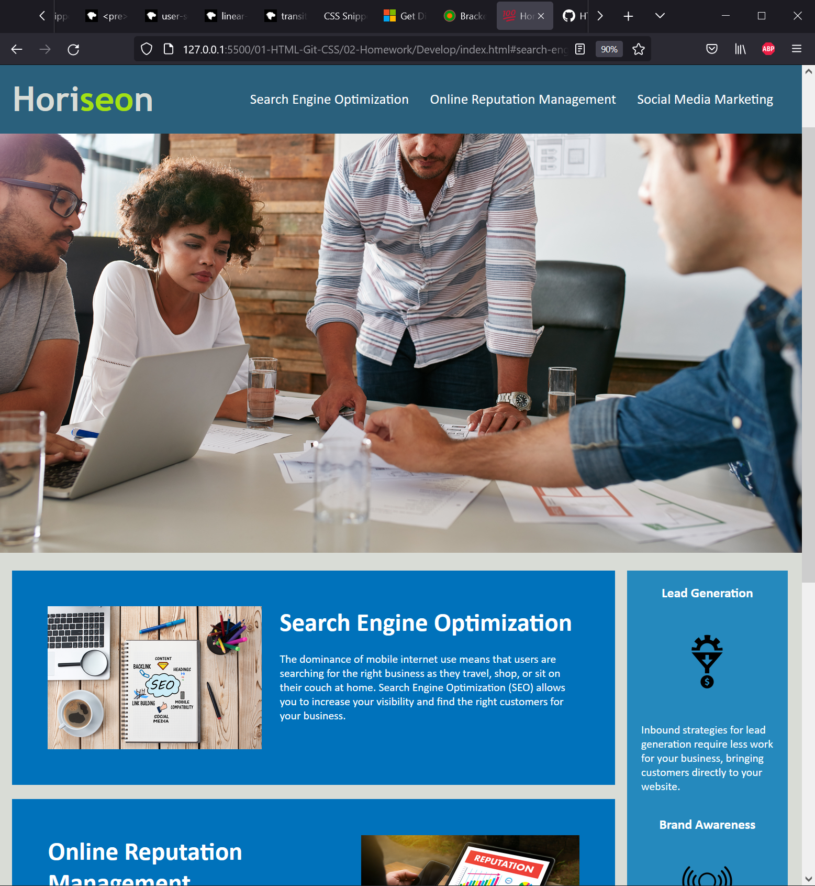

# HTML-CSS-GIT-Code-Refactor
An assignment in which I refactored the code provided from the class repository based on the following guidelines:

```
GIVEN a webpage meets accessibility standards
WHEN I view the source code
THEN I find semantic HTML elements
WHEN I view the structure of the HTML elements
THEN I find that the elements follow a logical structure independent of styling and positioning
WHEN I view the icon and image elements
THEN I find accessible alt attributes
WHEN I view the heading attributes
THEN they fall in sequential order
WHEN I view the title element
THEN I find a concise, descriptive title
```

## Screenshot of finished project


## Link to deployed application
https://swillswindle.github.io/HTML-CSS-GIT-Code-Refactor/